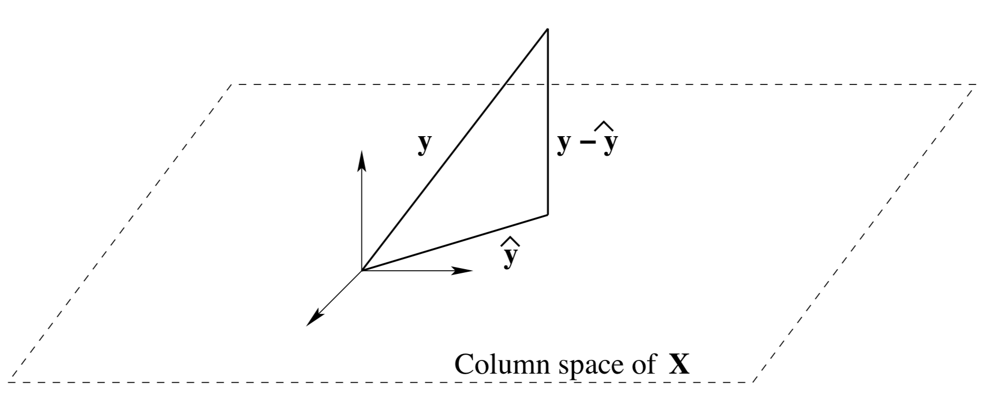

Objective: 
* Trying to predict the continuous variable Y which is a linear function of several continus variables x.

Model structure: 
* $$Y_i=\beta_0 + \beta_1 x_i + \epsilon_i$$

Assumption: 
* Y follows normal distribution, error $\epsilon_i$ is indepdent and has $\epsilon_i \sim N(0,\sigma^2)$. Data X is fixed 

Parameter estimate: 
* $\beta_0$ as intercept and $\beta_1$ as slope

Model selection: 
* feature selection 

Model fit: 
* $R^2$
* residual analysis
* F-statistic
<!--more-->

## Multiple Linear Regression Model
Multiple linear regression is a linear model with more than 1 variable. These variables are called dependent variables and the predict variable is called independent variables.

Where the formula for Multiple linear regression model is:
<p align="center">

</p> 
for i = 1,...,n is the number of observations or data. $p$ is the number of dependent variables. 

Hence the matrix notation for multiple linear regression is:

<p align="center">

</p> 

Which can also write in simple statement:
 <p align="center">

</p> 

Using leat square, we need to minimise this function 
 <p align="center">

</p>

To find the 'best'  $\beta$. One way is to find the relation between $y-\hat{y}$ and $X$:

 <p align="center">

</p> 



In this figure, the residuals $y-\hat{y}$ are [orthogonal](http://mathworld.wolfram.com/Orthogonal.html) to the columns of $X$:

<p align="center">

</p>
<p align="center">

</p> 
<p align="center">

</p> 

Then we can define 
<p align="center">

</p> 

Also we can use **Least Squares** as our loss(error) function which can minimize the Eucledian distance between the predicted $\hat{y}$ and actual $y$:

$Loss function =L = \frac{1}{2}\sum_{i=1}^{n}(y_i-\beta^Tx_i)^2=\frac{1}{2}||y-\beta x||^2 = \frac{1}{2}(y-x\beta)^T(y-x\beta)$

Finding the minium of the loss function, we can use differentiate for $\beta$:

$$\frac{dL}{d\beta}=-X^Ty+X^TX\beta=0$$

We still got the result:

$$\hat{\beta}=(X^TX)^{-1}X^Ty$$

This of course works only if the inverse exists. If the inverse does not exist, the normal equations can still be solved, but the solution may not be unique.

For fitted $\hat{y}$, we can plug in the $\hat{\beta}$

<p align="center">

</p> 

The matrix $H$ (Hat-matrix) is a $n*n$ matrix, it maps the observed values $y$ onto the fitted value $\hat{y}$

And residuals can be written as 
<p align="center">

</p> 

Here is a comparison between my own code build with [numpy](https://numpy.org) performance and the package in [sckit-learn](https://scikit-learn.org/stable/modules/generated/sklearn.linear_model.LinearRegression.htmln)
```python
X = np.array([[1, 1], [1, 2], [2, 2], [2, 3]])
# y = 1 * x_0 + 2 * x_1 + 3
y = np.dot(X, np.array([1, 2])) + 3

## add a column with value 1 at the left side of x 
x_with_constant = np.insert(x,0,1, axis=1)
x_t = np.transpose(x_with_constant)

beta = np.linalg.inv(x_t.dot(x_with_constant)).dot(x_t).dot(y)
## beta is array([3., 1., 2.])
y_pred =  np.array([[1,3,5]]).dot(beta)

y_pred
## array([16.])
```

```python
import numpy as np
from sklearn.linear_model import LinearRegression
x = np.array([[1, 1], [1, 2], [2, 2], [2, 3]])
# y = 1 * x_0 + 2 * x_1 + 3
y = np.dot(X, np.array([1, 2])) + 3
reg = LinearRegression().fit(X, y)
reg.score(X, y)
###  1.0
eg.coef_
## array([1., 2.])
reg.intercept_ 
### 3.0000...
reg.predict(np.array([[3, 5]]))
## array([16.])
```

Comparing to the function in sckit-learn, both of them can do the correct prediction. And other performance can be consider later...

## Reference 

[1] http://mezeylab.cb.bscb.cornell.edu/labmembers/documents/supplement%205%20-%20multiple%20regression.pdf